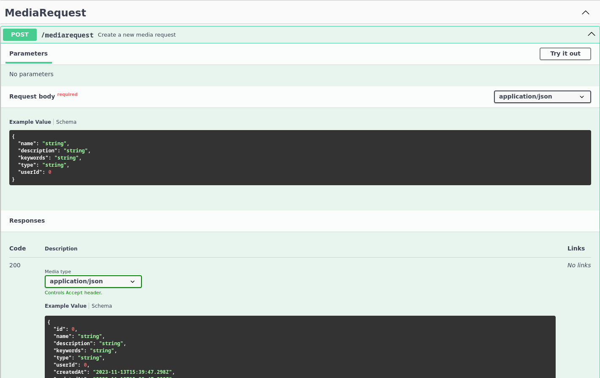
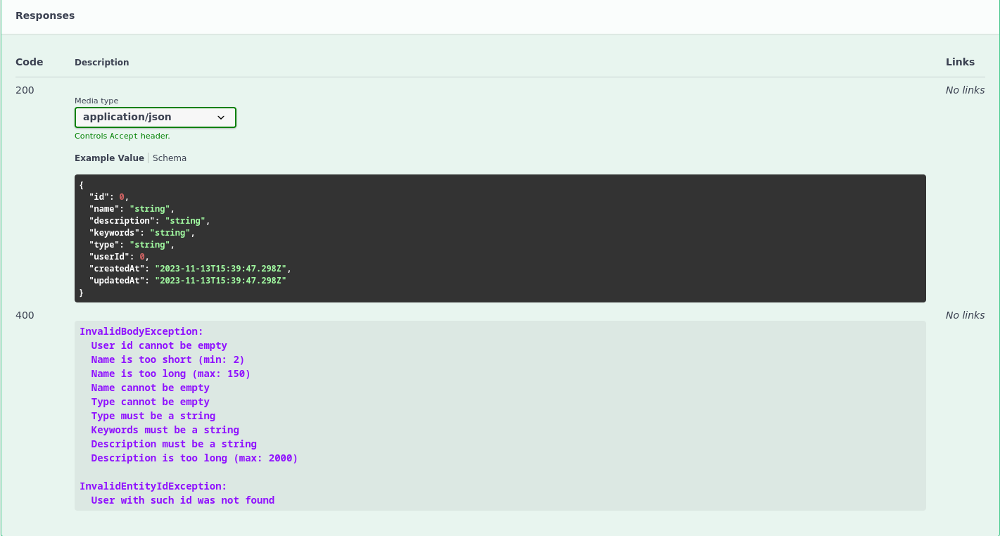
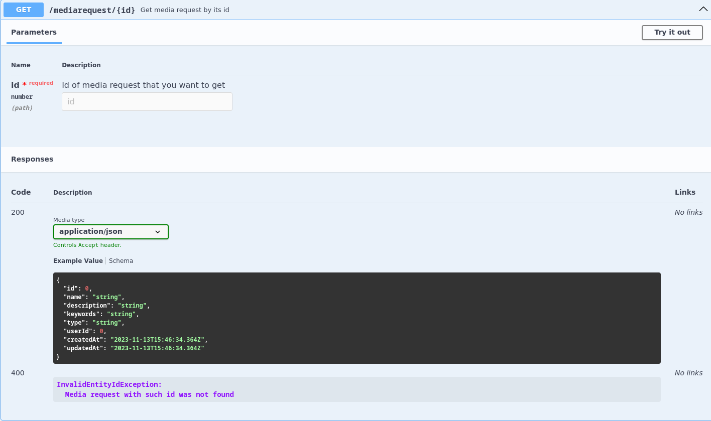
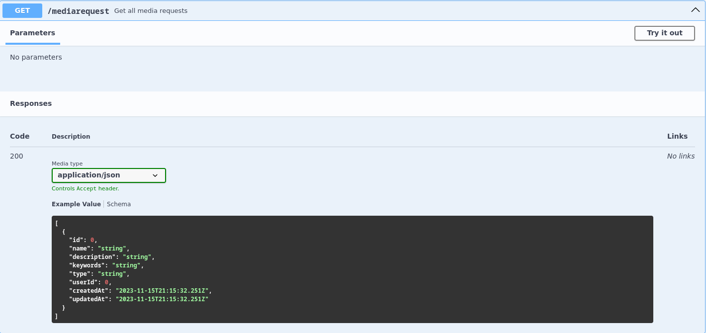
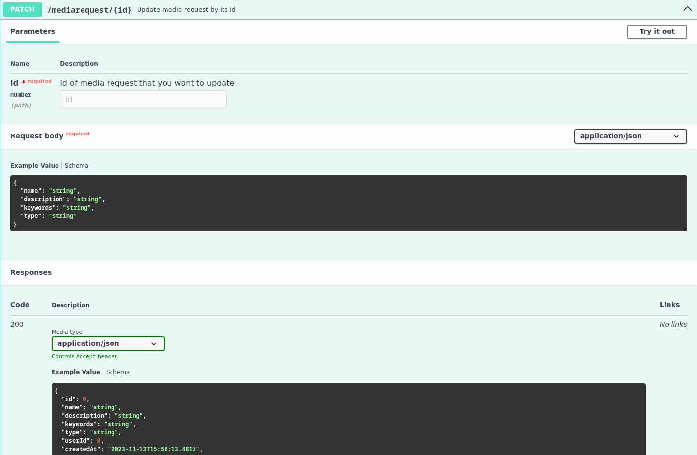
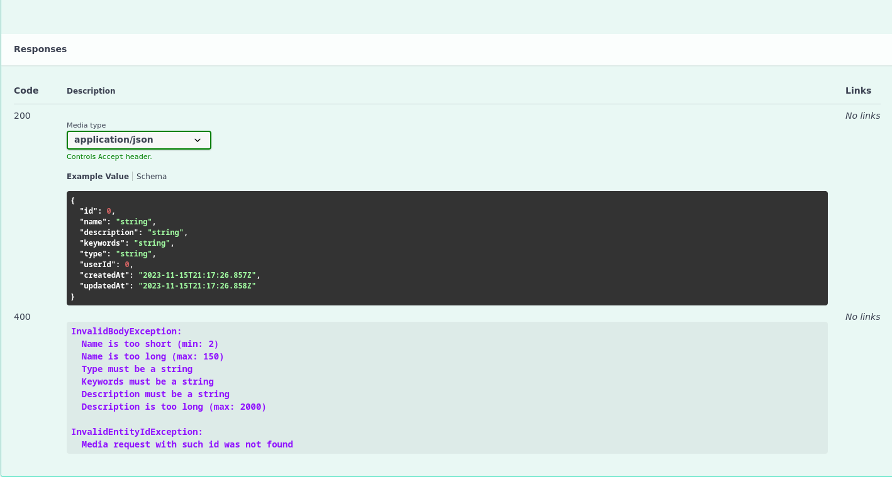
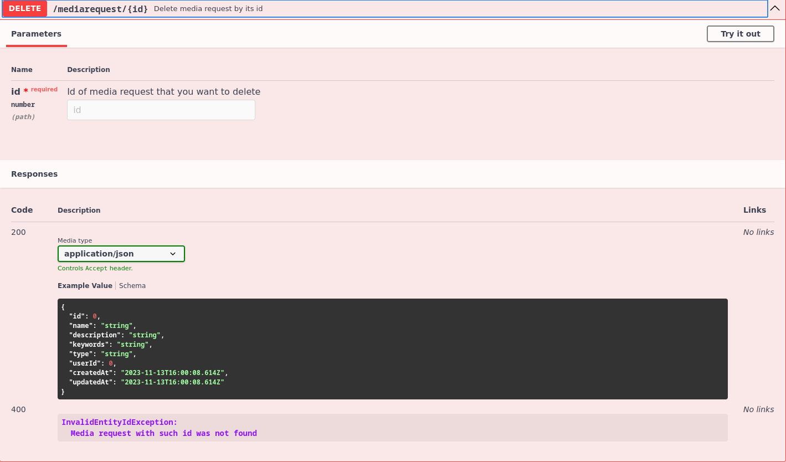

# Реалізація інформаційного та програмного забезпечення

## SQL-скрипт для створення початкового наповнення бази даних

```sql
-- MySQL Script generated by MySQL Workbench
-- Sun 05 Nov 2023 02:19:32 PM EET
-- Model: New Model    Version: 1.0
-- MySQL Workbench Forward Engineering

SET @OLD_UNIQUE_CHECKS=@@UNIQUE_CHECKS, UNIQUE_CHECKS=0;
SET @OLD_FOREIGN_KEY_CHECKS=@@FOREIGN_KEY_CHECKS, FOREIGN_KEY_CHECKS=0;
SET @OLD_SQL_MODE=@@SQL_MODE, SQL_MODE='ONLY_FULL_GROUP_BY,STRICT_TRANS_TABLES,NO_ZERO_IN_DATE,NO_ZERO_DATE,ERROR_FOR_DIVISION_BY_ZERO,NO_ENGINE_SUBSTITUTION';

-- -----------------------------------------------------
-- Schema mydb
-- -----------------------------------------------------

-- -----------------------------------------------------
-- Schema mydb
-- -----------------------------------------------------
CREATE SCHEMA IF NOT EXISTS `mydb` DEFAULT CHARACTER SET utf8 ;
USE `mydb` ;

-- -----------------------------------------------------
-- Table `mydb`.`action`
-- -----------------------------------------------------
DROP TABLE IF EXISTS `mydb`.`action` ;

CREATE TABLE IF NOT EXISTS `mydb`.`action` (
  `craeted_at` DATETIME NOT NULL,
  `state_id` INT NOT NULL,
  `media_request_id` INT NOT NULL,
  `source_id` INT NOT NULL,
  `user_id` INT NOT NULL,
  PRIMARY KEY (`state_id`, `media_request_id`, `source_id`, `user_id`),
  INDEX `fk_action_media_request1_idx` (`media_request_id` ASC) VISIBLE,
  INDEX `fk_action_source1_idx` (`source_id` ASC) VISIBLE,
  INDEX `fk_action_user1_idx` (`user_id` ASC) VISIBLE,
  CONSTRAINT `fk_action_state1`
    FOREIGN KEY (`state_id`)
    REFERENCES `mydb`.`state` (`id`)
    ON DELETE NO ACTION
    ON UPDATE NO ACTION,
  CONSTRAINT `fk_action_media_request1`
    FOREIGN KEY (`media_request_id`)
    REFERENCES `mydb`.`media_request` (`id`)
    ON DELETE NO ACTION
    ON UPDATE NO ACTION,
  CONSTRAINT `fk_action_source1`
    FOREIGN KEY (`source_id`)
    REFERENCES `mydb`.`source` (`id`)
    ON DELETE NO ACTION
    ON UPDATE NO ACTION,
  CONSTRAINT `fk_action_user1`
    FOREIGN KEY (`user_id`)
    REFERENCES `mydb`.`user` (`id`)
    ON DELETE NO ACTION
    ON UPDATE NO ACTION)
ENGINE = InnoDB;


-- -----------------------------------------------------
-- Table `mydb`.`based_on`
-- -----------------------------------------------------
DROP TABLE IF EXISTS `mydb`.`based_on` ;

CREATE TABLE IF NOT EXISTS `mydb`.`based_on` (
  `source_id` INT NOT NULL,
  `media_request_id` INT NOT NULL,
  PRIMARY KEY (`source_id`, `media_request_id`),
  INDEX `fk_source_has_media_request_media_request1_idx` (`media_request_id` ASC) VISIBLE,
  INDEX `fk_source_has_media_request_source1_idx` (`source_id` ASC) VISIBLE,
  CONSTRAINT `fk_source_has_media_request_source1`
    FOREIGN KEY (`source_id`)
    REFERENCES `mydb`.`source` (`id`)
    ON DELETE NO ACTION
    ON UPDATE NO ACTION,
  CONSTRAINT `fk_source_has_media_request_media_request1`
    FOREIGN KEY (`media_request_id`)
    REFERENCES `mydb`.`media_request` (`id`)
    ON DELETE NO ACTION
    ON UPDATE NO ACTION)
ENGINE = InnoDB;


-- -----------------------------------------------------
-- Table `mydb`.`feedback`
-- -----------------------------------------------------
DROP TABLE IF EXISTS `mydb`.`feedback` ;

CREATE TABLE IF NOT EXISTS `mydb`.`feedback` (
  `id` INT NOT NULL,
  `body` VARCHAR(255) NULL,
  `rating` FLOAT NOT NULL,
  `created_at` DATETIME NOT NULL,
  `updated_at` DATETIME NOT NULL,
  `media_request_id` INT NOT NULL,
  `user_id` INT NOT NULL,
  PRIMARY KEY (`id`, `user_id`, `media_request_id`),
  INDEX `fk_Feedback_MediaRequest1_idx` (`media_request_id` ASC) VISIBLE,
  INDEX `fk_Feedback_User1_idx` (`user_id` ASC) VISIBLE,
  CONSTRAINT `fk_Feedback_MediaRequest1`
    FOREIGN KEY (`media_request_id`)
    REFERENCES `mydb`.`media_request` (`id`)
    ON DELETE NO ACTION
    ON UPDATE NO ACTION,
  CONSTRAINT `fk_Feedback_User1`
    FOREIGN KEY (`user_id`)
    REFERENCES `mydb`.`user` (`id`)
    ON DELETE NO ACTION
    ON UPDATE NO ACTION)
ENGINE = InnoDB;


-- -----------------------------------------------------
-- Table `mydb`.`label`
-- -----------------------------------------------------
DROP TABLE IF EXISTS `mydb`.`label` ;

CREATE TABLE IF NOT EXISTS `mydb`.`label` (
  `tag_id` INT NOT NULL,
  `source_id` INT NOT NULL,
  PRIMARY KEY (`tag_id`, `source_id`),
  INDEX `fk_tag_has_source_source1_idx` (`source_id` ASC) VISIBLE,
  INDEX `fk_tag_has_source_tag1_idx` (`tag_id` ASC) VISIBLE,
  CONSTRAINT `fk_tag_has_source_tag1`
    FOREIGN KEY (`tag_id`)
    REFERENCES `mydb`.`tag` (`id`)
    ON DELETE NO ACTION
    ON UPDATE NO ACTION,
  CONSTRAINT `fk_tag_has_source_source1`
    FOREIGN KEY (`source_id`)
    REFERENCES `mydb`.`source` (`id`)
    ON DELETE NO ACTION
    ON UPDATE NO ACTION)
ENGINE = InnoDB;


-- -----------------------------------------------------
-- Table `mydb`.`media_request`
-- -----------------------------------------------------
DROP TABLE IF EXISTS `mydb`.`media_request` ;

CREATE TABLE IF NOT EXISTS `mydb`.`media_request` (
  `id` INT NOT NULL,
  `name` VARCHAR(255) NOT NULL,
  `description` VARCHAR(255) NULL,
  `keywords` VARCHAR(255) NULL,
  `type` VARCHAR(255) NOT NULL,
  `created_at` DATETIME NOT NULL,
  `updated_at` DATETIME NOT NULL,
  `user_id` INT NOT NULL,
  `source_id` INT NOT NULL,
  PRIMARY KEY (`id`, `user_id`, `source_id`))
ENGINE = InnoDB;


-- -----------------------------------------------------
-- Table `mydb`.`permission`
-- -----------------------------------------------------
DROP TABLE IF EXISTS `mydb`.`permission` ;

CREATE TABLE IF NOT EXISTS `mydb`.`permission` (
  `id` INT NOT NULL,
  `name` VARCHAR(255) NOT NULL,
  PRIMARY KEY (`id`))
ENGINE = InnoDB;


-- -----------------------------------------------------
-- Table `mydb`.`role`
-- -----------------------------------------------------
DROP TABLE IF EXISTS `mydb`.`role` ;

CREATE TABLE IF NOT EXISTS `mydb`.`role` (
  `id` INT NOT NULL,
  `name` VARCHAR(255) NOT NULL,
  `description` VARCHAR(255) NULL,
  PRIMARY KEY (`id`))
ENGINE = InnoDB;


-- -----------------------------------------------------
-- Table `mydb`.`role_has_permission`
-- -----------------------------------------------------
DROP TABLE IF EXISTS `mydb`.`role_has_permission` ;

CREATE TABLE IF NOT EXISTS `mydb`.`role_has_permission` (
  `role_id` INT NOT NULL,
  `permission_id` INT NOT NULL,
  PRIMARY KEY (`role_id`, `permission_id`),
  INDEX `fk_Role_has_Permission_Permission1_idx` (`permission_id` ASC) VISIBLE,
  INDEX `fk_Role_has_Permission_Role1_idx` (`role_id` ASC) VISIBLE,
  CONSTRAINT `fk_Role_has_Permission_Role1`
    FOREIGN KEY (`role_id`)
    REFERENCES `mydb`.`role` (`id`)
    ON DELETE NO ACTION
    ON UPDATE NO ACTION,
  CONSTRAINT `fk_Role_has_Permission_Permission1`
    FOREIGN KEY (`permission_id`)
    REFERENCES `mydb`.`permission` (`id`)
    ON DELETE NO ACTION
    ON UPDATE NO ACTION)
ENGINE = InnoDB;


-- -----------------------------------------------------
-- Table `mydb`.`source`
-- -----------------------------------------------------
DROP TABLE IF EXISTS `mydb`.`source` ;

CREATE TABLE IF NOT EXISTS `mydb`.`source` (
  `id` INT NOT NULL,
  `name` VARCHAR(255) NOT NULL,
  `url` VARCHAR(255) NOT NULL,
  PRIMARY KEY (`id`))
ENGINE = InnoDB;


-- -----------------------------------------------------
-- Table `mydb`.`state`
-- -----------------------------------------------------
DROP TABLE IF EXISTS `mydb`.`state` ;

CREATE TABLE IF NOT EXISTS `mydb`.`state` (
  `id` INT NOT NULL,
  `display_name` VARCHAR(255) NOT NULL,
  PRIMARY KEY (`id`))
ENGINE = InnoDB;


-- -----------------------------------------------------
-- Table `mydb`.`tag`
-- -----------------------------------------------------
DROP TABLE IF EXISTS `mydb`.`tag` ;

CREATE TABLE IF NOT EXISTS `mydb`.`tag` (
  `id` INT NOT NULL,
  `name` VARCHAR(255) NOT NULL,
  PRIMARY KEY (`id`))
ENGINE = InnoDB;


-- -----------------------------------------------------
-- Table `mydb`.`user`
-- -----------------------------------------------------
DROP TABLE IF EXISTS `mydb`.`user` ;

CREATE TABLE IF NOT EXISTS `mydb`.`user` (
  `id` INT NOT NULL,
  `first_name` VARCHAR(255) NOT NULL,
  `last_name` VARCHAR(255) NOT NULL,
  `username` VARCHAR(255) NOT NULL,
  `email` VARCHAR(255) NOT NULL,
  `password` VARCHAR(255) NOT NULL,
  `role_id` INT NOT NULL,
  PRIMARY KEY (`id`, `role_id`),
  INDEX `fk_User_Role1_idx` (`role_id` ASC) VISIBLE,
  UNIQUE INDEX `username_UNIQUE` (`username` ASC) VISIBLE,
  UNIQUE INDEX `email_UNIQUE` (`email` ASC) VISIBLE,
  CONSTRAINT `fk_User_Role1`
    FOREIGN KEY (`role_id`)
    REFERENCES `mydb`.`role` (`id`)
    ON DELETE NO ACTION
    ON UPDATE NO ACTION)
ENGINE = InnoDB;


SET SQL_MODE=@OLD_SQL_MODE;
SET FOREIGN_KEY_CHECKS=@OLD_FOREIGN_KEY_CHECKS;
SET UNIQUE_CHECKS=@OLD_UNIQUE_CHECKS;

-- -----------------------------------------------------
-- Data for table `mydb`.`permission`
-- -----------------------------------------------------
START TRANSACTION;
USE `mydb`;
INSERT INTO `mydb`.`permission` (`id`, `name`) VALUES (1, 'user.delete');
INSERT INTO `mydb`.`permission` (`id`, `name`) VALUES (2, 'user.role.promote');
INSERT INTO `mydb`.`permission` (`id`, `name`) VALUES (3, 'media.find');
INSERT INTO `mydb`.`permission` (`id`, `name`) VALUES (4, 'media.create');
INSERT INTO `mydb`.`permission` (`id`, `name`) VALUES (5, 'media.delete');
INSERT INTO `mydb`.`permission` (`id`, `name`) VALUES (6, 'media.edit');
INSERT INTO `mydb`.`permission` (`id`, `name`) VALUES (7, 'media.feedback.add');

COMMIT;


-- -----------------------------------------------------
-- Data for table `mydb`.`role`
-- -----------------------------------------------------
START TRANSACTION;
USE `mydb`;
INSERT INTO `mydb`.`role` (`id`, `name`, `description`) VALUES (1, 'User', 'An ordinary user of the system');
INSERT INTO `mydb`.`role` (`id`, `name`, `description`) VALUES (2, 'TechnicalExpert', 'Specialist in technical issues');

COMMIT;


-- -----------------------------------------------------
-- Data for table `mydb`.`role_has_permission`
-- -----------------------------------------------------
START TRANSACTION;
USE `mydb`;
INSERT INTO `mydb`.`role_has_permission` (`role_id`, `permission_id`) VALUES (2, 1);
INSERT INTO `mydb`.`role_has_permission` (`role_id`, `permission_id`) VALUES (2, 2);
INSERT INTO `mydb`.`role_has_permission` (`role_id`, `permission_id`) VALUES (1, 3);
INSERT INTO `mydb`.`role_has_permission` (`role_id`, `permission_id`) VALUES (2, 3);
INSERT INTO `mydb`.`role_has_permission` (`role_id`, `permission_id`) VALUES (1, 4);
INSERT INTO `mydb`.`role_has_permission` (`role_id`, `permission_id`) VALUES (2, 4);
INSERT INTO `mydb`.`role_has_permission` (`role_id`, `permission_id`) VALUES (1, 5);
INSERT INTO `mydb`.`role_has_permission` (`role_id`, `permission_id`) VALUES (2, 5);
INSERT INTO `mydb`.`role_has_permission` (`role_id`, `permission_id`) VALUES (1, 6);
INSERT INTO `mydb`.`role_has_permission` (`role_id`, `permission_id`) VALUES (2, 6);
INSERT INTO `mydb`.`role_has_permission` (`role_id`, `permission_id`) VALUES (1, 7);
INSERT INTO `mydb`.`role_has_permission` (`role_id`, `permission_id`) VALUES (2, 7);

COMMIT;


-- -----------------------------------------------------
-- Data for table `mydb`.`state`
-- -----------------------------------------------------
START TRANSACTION;
USE `mydb`;
INSERT INTO `mydb`.`state` (`id`, `display_name`) VALUES (1, 'Subscribe');
INSERT INTO `mydb`.`state` (`id`, `display_name`) VALUES (2, 'Unsubscribe');
INSERT INTO `mydb`.`state` (`id`, `display_name`) VALUES (3, 'Quarantine');

COMMIT;


-- -----------------------------------------------------
-- Data for table `mydb`.`tag`
-- -----------------------------------------------------
START TRANSACTION;
USE `mydb`;
INSERT INTO `mydb`.`tag` (`id`, `name`) VALUES (1, 'Sport');
INSERT INTO `mydb`.`tag` (`id`, `name`) VALUES (2, 'Science and Technology');
INSERT INTO `mydb`.`tag` (`id`, `name`) VALUES (3, 'Entertainment');
INSERT INTO `mydb`.`tag` (`id`, `name`) VALUES (4, 'Fashion and Style');
INSERT INTO `mydb`.`tag` (`id`, `name`) VALUES (5, 'Music');
INSERT INTO `mydb`.`tag` (`id`, `name`) VALUES (6, 'Food and Cooking');
INSERT INTO `mydb`.`tag` (`id`, `name`) VALUES (7, 'Tourism');
INSERT INTO `mydb`.`tag` (`id`, `name`) VALUES (8, 'Movies and Television');

COMMIT;

```

## RESTfull сервіс для управління даними

### Файл-схема бази даних

```prisma
generator client {
  provider = "prisma-client-js"
}

datasource db {
  provider = "mysql"
  url      = env("DATABASE_URL")
}

model User {
  id            Int            @id @default(autoincrement())
  firstName     String         @map("first_name")
  lastName      String         @map("last_name")
  username      String         @unique
  email         String         @unique
  password      String
  role          Role           @relation(fields: [roleId], references: [id], onDelete: Cascade)
  roleId        Int            @map("role_id")
  actions       Action[]
  feedbacks     Feedback[]
  mediaRequests MediaRequest[]

  @@map("users")
}

enum RoleName {
  USER
  TECHNICAL_EXPERT
}

model Role {
  id          Int                 @id @default(autoincrement())
  name        RoleName
  description String?
  users       User[]
  permissions RoleHasPermission[]

  @@map("roles")
}

model RoleHasPermission {
  role         Role       @relation(fields: [roleId], references: [id], onDelete: Cascade)
  roleId       Int        @map("role_id")
  permission   Permission @relation(fields: [permissionId], references: [id], onDelete: Cascade)
  permissionId Int        @map("permission_id")

  @@id([roleId, permissionId])
  @@map("role_has_permission")
}

model Permission {
  id    Int                 @id @default(autoincrement())
  name  String
  roles RoleHasPermission[]

  @@map("permissions")
}

model Feedback {
  id             Int          @id @default(autoincrement())
  body           String
  rating         Float
  user           User         @relation(fields: [userId], references: [id], onDelete: Cascade)
  userId         Int          @map("user_id")
  mediaRequest   MediaRequest @relation(fields: [mediaRequestId], references: [id], onDelete: Cascade)
  mediaRequestId Int          @map("media_request)id")
  createdAt      DateTime     @default(now()) @map("created_at")
  updatedAt      DateTime     @updatedAt @map("updated_at")

  @@map("feedbacks")
}

model MediaRequest {
  id          Int        @id @default(autoincrement())
  name        String
  description String?
  keywords    String?
  type        String
  user        User       @relation(fields: [userId], references: [id], onDelete: Cascade)
  userId      Int        @map("user_id")
  feedbacks   Feedback[]
  sources     BasedOn[]
  actions     Action[]
  createdAt   DateTime   @default(now()) @map("created_at")
  updatedAt   DateTime   @updatedAt @map("updated_at")

  @@map("media_requests")
}

model BasedOn {
  source         Source       @relation(fields: [sourceId], references: [id], onDelete: Cascade)
  sourceId       Int          @map("source_id")
  mediaRequest   MediaRequest @relation(fields: [mediaRequestId], references: [id], onDelete: Cascade)
  mediaRequestId Int          @map("media_request_id")

  @@id([sourceId, mediaRequestId])
  @@map("based_on")
}

model Source {
  id            Int       @id @default(autoincrement())
  name          String
  url           String
  mediaRequests BasedOn[]
  labels        Label[]
  actions       Action[]

  @@map("sources")
}

model Label {
  source   Source @relation(fields: [sourceId], references: [id], onDelete: Cascade)
  sourceId Int    @map("source_id")
  tag      Tag    @relation(fields: [tagId], references: [id], onDelete: Cascade)
  tagId    Int    @map("tag_id")

  @@id([sourceId, tagId])
  @@map("labels")
}

enum TagName {
  SPORT
  SCIENCE_AND_TECHOLOGY
  ENTERTAINMENT
  FASHION_AND_STYLE
  MUSIC
  FOOD_AND_COOKING
  TOURISM
  MOVIES_AND_TELEVISION
}

model Tag {
  id     Int     @id @default(autoincrement())
  name   TagName
  labels Label[]

  @@map("tags")
}

model Action {
  mediaRequest   MediaRequest @relation(fields: [mediaRequestId], references: [id], onDelete: Cascade)
  mediaRequestId Int          @map("media_request_id")
  source         Source       @relation(fields: [sourceId], references: [id], onDelete: Cascade)
  sourceId       Int          @map("source_id")
  user           User         @relation(fields: [userId], references: [id], onDelete: Cascade)
  userId         Int          @map("user_id")
  state          State        @relation(fields: [stateId], references: [id], onDelete: Cascade)
  stateId        Int          @map("state_id")

  @@id([mediaRequestId, sourceId, userId, stateId])
  @@map("actions")
}

enum StateName {
  SUBSCRIBE
  UNSUBSCRIBE
  QUARANTINE
}

model State {
  id          Int       @id @default(autoincrement())
  displayName StateName @map("display_name")
  actions     Action[]

  @@map("states")
}
```
### Сервіс підключення до бази даних

```ts
import { Injectable, OnModuleDestroy, OnModuleInit } from '@nestjs/common';
import { PrismaClient } from '@prisma/client';

@Injectable()
export class PrismaService extends PrismaClient implements OnModuleInit, OnModuleDestroy {
  async onModuleInit () {
    await this.$connect();
  }

  async onModuleDestroy () {
    await this.$disconnect();
  }
}
```

### Модуль підключення до бази даних

```ts
import { Global, Module } from '@nestjs/common';
import { PrismaService } from './PrismaService';

@Global()
@Module({
  providers: [PrismaService],
  exports: [PrismaService],
})
export class PrismaModule {}
```

### Модуль для обробки запитів

```ts
import { Module } from '@nestjs/common';
import { MediaRequestController } from './MediaRequestController';
import { MediaRequestService } from './MediaRequestService';
import { PrismaModule } from '../prisma/PrismaModule';

@Module({
  controllers: [MediaRequestController],
  providers: [MediaRequestService],
  imports: [PrismaModule],
})
export class MediaRequestModule {}
```

### Контролер для обробки запитів

```ts
import { Body, Controller, Get, Param, Post, ParseIntPipe, Patch, Delete } from '@nestjs/common';
import { ApiBadRequestResponse, ApiOkResponse, ApiOperation, ApiParam, ApiTags } from '@nestjs/swagger';
import { MediaRequestService } from './MediaRequestService';
import { MediaRequestResponse } from './MediaRequestResponse';
import { CreateMediaRequestDto } from './CreateMediaRequestDto';
import { UpdateMediaRequestDto } from './UpdateMediaRequestDto';
import { UserValidationPipe } from '../utils/UserValidationPipe';
import { MediaRequestValidationPipe } from '../utils/MediaRequestValidationPipe';

@ApiTags('MediaRequest')
@Controller('/mediarequest')
export class MediaRequestController {
  constructor (private mediaRequestService: MediaRequestService) {}

  @ApiOkResponse({
    type: MediaRequestResponse,
  })
  @ApiBadRequestResponse({
    description: `\n
    InvalidBodyException:
      User id cannot be empty
      Name is too short (min: 2)
      Name is too long (max: 150)
      Name cannot be empty
      Type cannot be empty
      Type must be a string
      Keywords must be a string
      Description must be a string
      Description is too long (max: 2000)
    
    InvalidEntityIdException:
      User with such id was not found`,
  })
  @ApiOperation({
    summary: 'Create a new media request',
  })
  @Post()
  async create (@Body(UserValidationPipe) data: CreateMediaRequestDto) {
    return this.mediaRequestService.createMediaRequest(data);
  }

  @ApiOkResponse({
    type: MediaRequestResponse,
  })
  @ApiBadRequestResponse({
    description: `\n
    InvalidEntityIdException:
      Media request with such id was not found`,
  })
  @ApiParam({
    name: 'id',
    type: Number,
    required: true,
    description: 'Id of media request that you want to get',
  })
  @ApiOperation({
    summary: 'Get media request by its id',
  })
  @Get('/:id')
  async getMediaResponse (@Param('id', ParseIntPipe, MediaRequestValidationPipe) id: number) {
    return this.mediaRequestService.getMediaRequest(id);
  }

  @ApiOkResponse({
    type: [MediaRequestResponse],
  })
  @ApiOperation({
    summary: 'Get all media requests',
  })
  @Get()
  async getAllMediaRequests () {
    return this.mediaRequestService.getAllMediaRequests();
  }

  @ApiOkResponse({
    type: MediaRequestResponse,
  })
  @ApiBadRequestResponse({
    description: `\n
    InvalidBodyException:
      Name is too short (min: 2)
      Name is too long (max: 150)
      Type must be a string
      Keywords must be a string
      Description must be a string
      Description is too long (max: 2000)
    
    InvalidEntityIdException:
      Media request with such id was not found`,
  })
  @ApiParam({
    name: 'id',
    type: Number,
    required: true,
    description: 'Id of media request that you want to update',
  })
  @ApiOperation({
    summary: 'Update media request by its id',
  })
  @Patch('/:id')
  async update (
    @Param('id', ParseIntPipe, MediaRequestValidationPipe) id: number,
    @Body() data: UpdateMediaRequestDto,
  ) {
    return this.mediaRequestService.updateMediaRequest(id, data);
  }

  @ApiOkResponse({
    type: MediaRequestResponse,
  })
  @ApiBadRequestResponse({
    description: `\n
    InvalidEntityIdException:
      Media request with such id was not found`,
  })
  @ApiParam({
    name: 'id',
    type: Number,
    required: true,
    description: 'Id of media request that you want to delete',
  })
  @ApiOperation({
    summary: 'Delete media request by its id',
  })
  @Delete('/:id')
  async deleteMediaRequest (
    @Param('id', ParseIntPipe, MediaRequestValidationPipe) id: number
  ) {
    return this.mediaRequestService.deleteMediaRequest(id);
  }
}
```

### Сервіс для обробки запитів

```ts
import { Injectable } from '@nestjs/common';
import { PrismaService } from '../prisma/PrismaService';
import { MediaRequestResponse } from './MediaRequestResponse';
import { CreateMediaRequestDto } from './CreateMediaRequestDto';
import { UpdateMediaRequestDto } from './UpdateMediaRequest';

@Injectable()
export class MediaRequestService {
  constructor (private prismaService: PrismaService) {}

  async createMediaRequest (data: CreateMediaRequestDto): Promise<MediaRequestResponse> {
    return this.prismaService.mediaRequest.create({
      data,
    });
  }

  async getMediaRequest (id: number): Promise<MediaRequestResponse> {
    return this.prismaService.mediaRequest.findUnique({
      where: {
        id,
      },
    });
  }

  async getAllMediaRequests (): Promise<MediaRequestResponse[]> {
    return this.prismaService.mediaRequest.findMany();
  }

  async updateMediaRequest (id: number, data: UpdateMediaRequestDto): Promise<MediaRequestResponse> {
    return this.prismaService.mediaRequest.update({
      where: {
        id,
      },
      data,
    });
  }

  async deleteMediaRequest (id: number): Promise<MediaRequestResponse> {
    return this.prismaService.mediaRequest.delete({
      where: {
        id,
      },
    });
  }
}
```

### Dto для створення медіа-контенту

```ts
import { ApiProperty, ApiPropertyOptional } from '@nestjs/swagger';
import { IsNotEmpty, IsNumber, IsOptional, IsString, MaxLength, MinLength } from 'class-validator';
import { Transform } from 'class-transformer';
import { validationOptionsMsg } from '../utils/ValidationOptionsMsg';


export class CreateMediaRequestDto {
  @ApiProperty({
    description: 'Name of the media request',
  })
  @MinLength(2, validationOptionsMsg('Name is too short (min: 2)'))
  @MaxLength(150, validationOptionsMsg('Name is too long (max: 150)'))
  @IsNotEmpty(validationOptionsMsg('Name cannot be empty'))
    name: string;

  @ApiPropertyOptional({
    description: 'The description of the media request',
  })
  @IsOptional()
  @MaxLength(2000, validationOptionsMsg('Description is too long (max: 2000)'))
  @IsString(validationOptionsMsg('Description must be a string'))
    description?: string;

  @ApiPropertyOptional({
    description: 'The keywords of the media request',
  })
  @IsOptional()
  @IsString(validationOptionsMsg('Keywords must be a string'))
    keywords?: string;

  @ApiProperty({
    description: 'Type of the media request',
  })
  @IsString(validationOptionsMsg('Type must be a string'))
  @IsNotEmpty(validationOptionsMsg('Type cannot be empty'))
    type: string;

  @ApiProperty({
    description: 'Id of the user',
  })
  @IsNumber()
  @Transform(({ value }) => parseInt(value))
  @IsNotEmpty(validationOptionsMsg('Id of the user cannot be empty'))
    userId: number;
}
```

### Dto для оновлення медіа-контенту

```ts
import { ApiPropertyOptional } from '@nestjs/swagger';
import { IsOptional, IsString, MaxLength, MinLength } from 'class-validator';
import { validationOptionsMsg } from '../utils/ValidationOptionsMsg';

export class UpdateMediaRequestDto {
  @ApiPropertyOptional({
    description: 'Name of the updated media request',
  })
  @IsString()
  @MinLength(2, validationOptionsMsg('Name is too short (min: 2)'))
  @MaxLength(150, validationOptionsMsg('Name is too long (max: 150)'))
  @IsOptional()
    name?: string;

  @ApiPropertyOptional({
    description: 'Description of the updated media request',
  })
  @IsString(validationOptionsMsg('Description must be a string'))
  @MaxLength(2000, validationOptionsMsg('Description is too long (max: 2000)'))
  @IsOptional()
    description?: string;

  @ApiPropertyOptional({
    description: 'Keywords of the updated media request',
  })
  @IsOptional()
  @IsString(validationOptionsMsg('Keywords must be a string'))
    keywords?: string;

  @ApiPropertyOptional({
    description: 'Type of the updated media request',
  })
  @IsOptional()
  @IsString(validationOptionsMsg('Type must be a string'))
    type?: string;
}
```

### Відповідь для медіа-контенту

```ts
import { ApiProperty } from '@nestjs/swagger';

export class MediaRequestResponse {
  @ApiProperty({
    description: 'The id of the media request',
  })
    id: number;

  @ApiProperty({
    description: 'The name of the media request',
  })
    name: string;

  @ApiProperty({
    description: 'Additional information about the media request',
  })
    description: string;

  @ApiProperty({
    description: 'Keywords about the media request',
  })
    keywords: string;

  @ApiProperty({
    description: 'The type of the media request',
  })
    type: string;

  @ApiProperty({
    description: 'The id of the user',
  })
    userId: number;

  @ApiProperty({
    description: 'The date, when the media request was create',
  })
    createdAt: Date;

  @ApiProperty({
    description: 'The date, when the media request was updated',
  })
    updatedAt: Date;
}
```

### Виключна ситуація: "Сутність не знайдена за її ідентифікатором"

```ts
import { HttpException, HttpStatus } from '@nestjs/common';

export class InvalidEntityIdException extends HttpException {
  constructor (entity: string) {
    super(`${entity} with such id was not found`, HttpStatus.BAD_REQUEST);
  }
}
```

### Validation pipes для користувача

```ts
import { Injectable, PipeTransform } from '@nestjs/common';
import { PrismaService } from '../prisma/PrismaService';
import { InvalidEntityIdException } from './InvalidEntityIdException';
import { CreateMediaRequestDto } from '../media-request/CreateMediaRequestDto';

@Injectable()
export class UserValidationPipe implements PipeTransform {
  constructor (private prismaService: PrismaService) {}

  async transform (data: CreateMediaRequestDto) {
    const user = await this.prismaService.user.findUnique({
      where: {
        id: data.userId,
      },
    });
    if (!user) throw new InvalidEntityIdException('User');
    return data;
  }
}
```

### Validation pipes для медіа-контенту

```ts
import { Injectable, PipeTransform } from '@nestjs/common';
import { PrismaService } from '../prisma/PrismaService';
import { InvalidEntityIdException } from './InvalidEntityIdException';

@Injectable()
export class MediaRequestValidationPipe implements PipeTransform {
  constructor (private prismaService: PrismaService) {}

  async transform (id: number) {
    const mediaRequest = await this.prismaService.mediaRequest.findUnique({
      where: {
        id,
      },
    });
    if (!mediaRequest) throw new InvalidEntityIdException('MediaRequest');
    return id;
  }
}
```

### Функція для повідомлення про помилку для декораторів

```ts
import { ValidationOptions } from 'class-validator';

export function validationOptionsMsg (message:string): ValidationOptions {
  return { message };
}
```

### Головний модуль RestApi

```ts
import { Module } from '@nestjs/common';
import { MediaRequestModule } from './media-request/MediaRequestModule';
@Module({
  imports: [MediaRequestModule],
})
export class AppModule {}

```

### Точка входу RestApi (main.ts)

```ts
import { NestFactory } from '@nestjs/core';
import { AppModule } from './AppModule';
import { ValidationPipe } from '@nestjs/common';
import { DocumentBuilder, SwaggerModule } from '@nestjs/swagger';

async function bootstrap () {
  const app = await NestFactory.create(AppModule);
  const port = 3000;
  app.useGlobalPipes(
    new ValidationPipe({
      transform: true,
      whitelist: true,
    })
  );

  const config = new DocumentBuilder()
    .setTitle('Media Request API')
    .setDescription('Here is Media Request API documentation')
    .setVersion('2.0.4')
    .addTag('api')
    .addBearerAuth()
    .build();
  const document = SwaggerModule.createDocument(app, config);
  SwaggerModule.setup('api', app, document);
  await app.listen(port);
  console.info(`Started server on 127.0.0.1:${port}`);
}
bootstrap();
```

## Документація з використанням Swagger

### POST-запит 

<p align="center">
    
    <br><br>
    
</p>

### GET-запит (отримати за id)

<p align="center">
    
</p>

### GET-запит (отримати всі)

<p align="center">
    
</p>


### PATCH-запит 

<p align="center">
    
    <br><br>
    
</p>

### DELETE-запит 

<p align="center">
    
</p>
