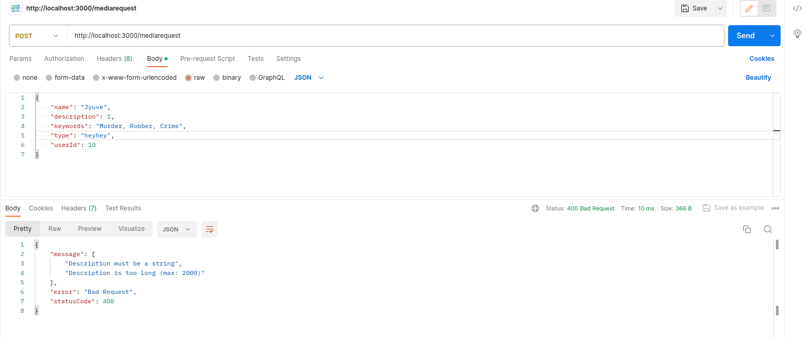

# Тестування працездатності системи

## Запуск системи

    

## POST-запит

    

## GET-запит

    

## PATCH-запит

    

## DELETE-запит 

    

## Виклюячна ситуація: "Користувача з таким ідентифікатором не знайдено"

    

## Виклюячна ситуація: "Медіа-контент з таким ідентифікатором не знайдено"

    

## Виклюячна ситуація: "Назва медіа-контенту не може бути пустою"

    

## Виклюячна ситуація: "Тип медіа-контенту повинен бути рядком"

    

## Виклюячна ситуація: "Опис медіа-контенту повинен бути рядком"

    

